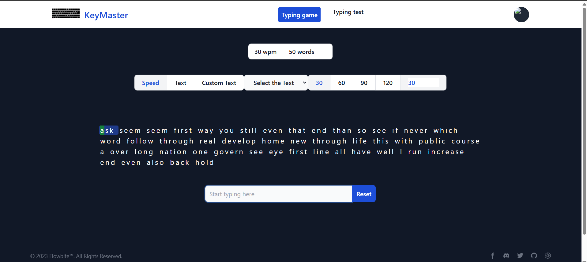
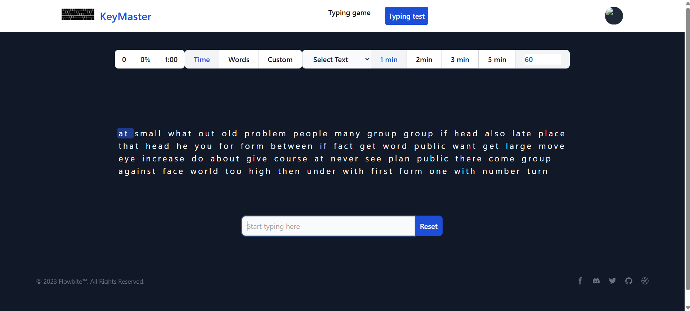

## 📋 Description

**React Typing App** is an interactive typing test and game where users can measure their typing speed and accuracy. It includes WPM calculations, letter highlighting, dynamic test text, and a competitive typing mode against the computer.

This app also includes a `.NET Web API` backend for user performance tracking and dynamic text management.

---

## 🛠 Tech Stack

- 🎯 **Frontend**: React.js, Context API, CSS
- 🧠 **Backend**: .NET Web API
- 🗃 **Database**: SQL Server
- 📦 **Package Manager**: npm
- 🔐 **Authentication**: JWT (planned)

---

## 🎮 Live Demo

🔗 [Try it now on GitHub Pages](🔗 https://dilshannirodha.github.io/deploy-react-typing-game/)

---

## 📸 Screenshots

<table>
  <tr>
    <td align="center">
       
      <b>Typing Game UI</b>
    </td>
    <td align="center">
       
      <b>Typing Test UI</b>
    </td>
  </tr>
</table>

